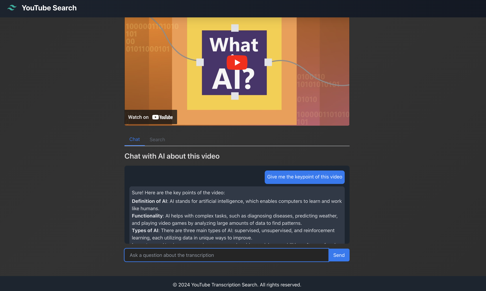

# YouTube Search



## Welcome! 👋

Ever feel like there's just not enough time in the day to watch all those amazing YouTube videos you've bookmarked? As a parent of two wonderful (but time-consuming) kids, I found myself in the same boat. That's when I had an idea: what if I could quickly get the gist of a video without having to watch the entire thing?

That's how this project was born. It's a proof of concept (POC) designed to help summarize YouTube videos quickly and easily. Now I can catch up on all that interesting content during those rare quiet moments between diaper changes and snack times. 😅

## What Does This App Do?

This app is like having a super-smart assistant who watches YouTube videos for you and then lets you chat about them. Here's the rundown:

1. **Transcribe YouTube Videos**: Just paste in a YouTube URL, and voilà! The app grabs the audio and turns it into text.
2. **Smart Search**: Want to find a specific part of the video? Just search for keywords in the transcription.
3. **AI-Powered Chat**: You can actually chat with an AI about the video content. It's like having a study buddy who's watched the video a million times.

## The Tech Stuff (for My Fellow Geeks)

If you're into the details, here's what's under the hood:

- **Frontend**: React with Next.js, for a speedy, SEO-friendly app.
- **Styling**: Tailwind CSS, making things pretty without the CSS headaches.
- **Backend**: Next.js API routes, keeping things nice and tidy in one project.
- **Transcription**: OpenAI's Whisper model, because it's excellent at turning speech into text.
- **Chat AI**: GPT-4, the brains behind our chatty assistant.
- **Database**: SQLite, keeping things simple for storing transcriptions.
- **Video Processing**: ytdl-core and fluent-ffmpeg, doing the heavy lifting for grabbing YouTube audio.

## Architecture in a Nutshell

1. **User Interface**: A slick React app with tabs for chat and search.
2. **API Layer**: Next.js API routes handling transcription requests and AI chat.
3. **Data Flow**: 
   - YouTube URL → Download Audio → Transcribe → Store in SQLite
   - User Query → Fetch Transcription → AI Processing → Chat Response

## Want to Try It Out?

You have two options to run the app:

### Option 1: Local Development

1. Clone the repository: `git clone [your-repo-url]`
2. Install dependencies: `npm install`
3. Set up your `.env` file with your OpenAI API key
4. Start the development server: `npm run dev`
5. Head to `http://localhost:3000` and give it a go!

### Option 2: Docker

If you prefer using Docker, follow these steps:

1. Clone the repository: `git clone [your-repo-url]`
2. Make sure you have Docker and Docker Compose installed on your system
3. Create a `.env` file in the root directory and add your OpenAI API key:
   ```
   OPENAI_API_KEY=your_api_key_here
   ```
4. Build and run the Docker container:
   ```
   docker-compose up --build
   ```
5. Once the container is running, visit `http://localhost:3000` in your browser

Note: When using Docker, the transcriptions will be stored in a SQLite database inside the container. The database file is mounted as a volume, so your transcriptions will persist even if you stop and restart the container.

## What's Next?

This is just a POC. There's a lot of stuff that's missing.
- Summarization features (because sometimes you want the TL;DR)
- Multi-language support (for when you're feeling international)
- Video chapter generation (jump to the good parts)
- Authentication
- A more robust error handling system
- This POC is currently single user. I'd like to add multi-user support with proper authentication.
- It would be nice to be able to upload your own videos.
- The transcription is stored in SQLite. It would be nice to be able to remove them later.
- The chat interface is very basic. It would be nice to have message history, threads, etc.
- It does not handle large videos well.

Feel free to contribute, suggest ideas, or just give it a spin and let me know what you think. Happy watching (or not watching, but learning anyway)! 🎉
